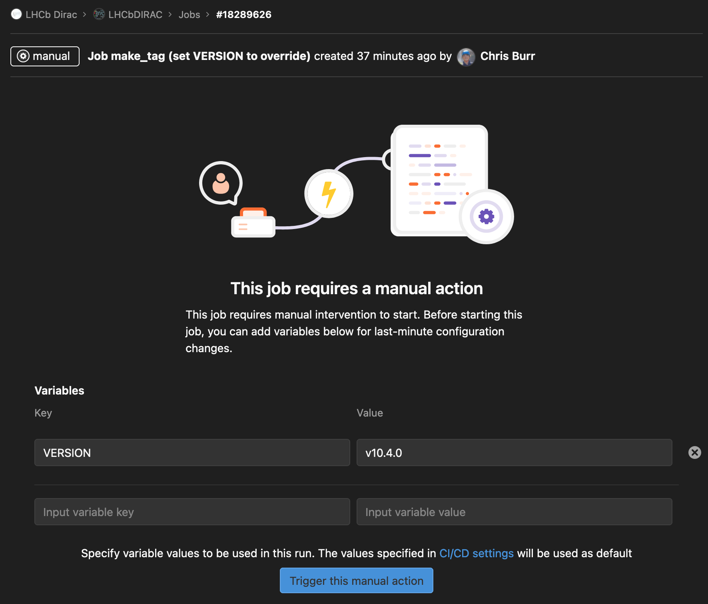

.. _make-release:

==================
LHCbDIRAC Releases
==================

The following procedure applies fully to LHCbDIRAC production releases, like patches.
For pre-releases (AKA certification releases, there are some minor changes to consider).

Prerequisites
=============

The release manager needs to:

- be aware of the LHCbDIRAC repository structure and branching as highlighted in the  `contribution guide <https://gitlab.cern.ch/lhcb-dirac/LHCbDIRAC/blob/master/CONTRIBUTING.md>`_.
- have push access to the master branch of "upstream" (being part of the project "owners")
- have DIRAC installed
- have been granted write access to <webService>
- have "lhcb_admin" or "diracAdmin" role.
- have a Proxy

The release manager of LHCbDIRAC has the triple role of:

1. creating the release
2. making basic verifications
3. deploying it in production


1. Creating the release
=======================

Unless otherwise specified, (patch) releases of LHCbDIRAC are usually done "on top" of the latest production release of DIRAC.
The following of this guide assumes the above is true.

Creating a release of LHCbDIRAC means creating a tarball that contains the release code. This is done in 3 steps:

1. Merging "Merge Requests"
2. Propagating to the devel branch (for patches)
3. Creating the release tarball, add uploading it to the LHCb web service


Merging "Merge Requests"
````````````````````````

`Merge Requests (MR) <https://gitlab.cern.ch/lhcb-dirac/LHCbDIRAC/merge_requests>`_ that are targeted to the master branch
and that have been approved by a reviewer are ready to be merged

Otherwise, simply click the "Accept merge request" button for each of them.

If you are making a Major release please merge devel to master follow the instruction: :ref:`devel_to_master`.

Propagate to the devel branch
`````````````````````````````

Automatic propagation
"""""""""""""""""""""
The LHCbDIRAC repo has a webhook installed to trigger a job in `GitLab(lhcb-dirac/sweeper) <https://gitlab.cern.ch/lhcb-dirac/sweeper>`_  for each MR action taken on the repo.
The pipeline in this repo converts all the information from GitLab hook to environment variables that are accessible for usage.
For each MR that it is determined that it targets ``master`` we call the script ``labelMR.py`` (in lhcb-dirac/sweeper) to add the label ``alsoTargeting:devel``.
This is a hint for the subsequent procedure to cherry-pick this MR into ``devel``.

The automatic cherry-picking (also referred to as sweeping), is performed in the CI job ``MR_SWEEP``, which tries to cheery-pick the merged MRs into a new branch and open a new MR against ``devel``.
This mechanism is only triggered on MRs that have the label ``alsoTargeting:devel``. Once the mechanism finished the merged MR will receive the label ``sweep:done``.
In the case an automatic sweep is not possible (e.g. merge conflict) the MR will receive the label ``sweep:failed``, in the comment of the MR you will see a link to the job where the sweep was attempted.
In the log this job you will see a hint how to reproduce the failed merge, so the you can manually resolve the problem e.g.::

  git checkout devel
  git cherry-pick -m 1 9f142d8c1
  git status

To not overlook failed sweeps, it is advisable that you subscribe to the label `sweep:failed` in `GitLab Labels <https://gitlab.cern.ch/lhcb-dirac/LHCbDIRAC/-/labels>`_.
If everything is successful, after merging something to ``master`` in a relatively short period of time a MR should appear that is the result of the sweep, it will have the label ``sweep:from master``.

Manual propagation
""""""""""""""""""

Before you start doing any merging it's good to setup the correct merge driver, you do this by adding to your .gitconfig

  [merge "ours"]
        driver = true

this lets git know which files you want to ignore when you merge `master` into `devel`.

Now, you need to make sure that what's merged in master is propagated to the devel branch. From the local fork::

  # get the updates (this never hurts!)
  git fetch upstream
  # create a "newDevel" branch which from the upstream/devel branch
  git checkout -b newDevel upstream/devel
  # merge in newDevel the content of upstream/master
  git merge upstream/master

The last operation may result in potential conflicts.
If happens, you'll need to manually update the conflicting files (see e.g. this `guide <https://githowto.com/resolving_conflicts>`_).
As a general rule, prefer the master fixes to the "HEAD" (devel) fixes. Remember to add and commit once fixed.

Please fix the conflict if some files are conflicting. Do not forget to to execute the following::

  git add -A && git commit -m " message"

Conflicts or not, you'll need to push back to upstream::

  # push "newDevel" to upstream/devel
  git push upstream newDevel:devel
  # delete your local newDevel
  git checkout upstream/devel
  git branch -d newDevel
  # keep your repo up-to-date
  git fetch upstream

Create/Trigger release
``````````````````````

To create a release you go to the pipelines https://gitlab.cern.ch/lhcb-dirac/LHCbDIRAC/-/pipelines and go the last pipeline of the branch you want to tag.
At the end of the pipeline there is a manual trigger job with name `make_tag`, you clic on it and you will get the following windows



As key you can specify the versions you want your release to be based upon. If you don't specify any version only the LHCbDIRAC patch version will be increased for +1.
After you have set the proper values press trigger this manual action. This will create the release for you and creating the release tarball, and uploading it to the LHCb web service

Automatic procedure
```````````````````

When a new git tag is pushed to the repository, a gitlab-ci job takes care of testing, creating the tarball, uploading it to the web service, and to build the docker image. You can check it in the pipeline page of the repository (https://gitlab.cern.ch/lhcb-dirac/LHCbDIRAC/pipelines).

It may happen that the pipeline fails. There are various reasons for that, but normally, it is just a timeout on the runner side, so just restart the job from the pipeline web interface. If it repeatedly fails building the tarball, try the manual procedure described bellow to understand.
**If any of the pipelines fails, don't try to do a release manually but rather investigate why.**


2. Making basic verifications
=============================

Once the tarball is done and uploaded, the release manager is asked to make basic verifications,
to see if the release has been correctly created. Within GitLab-CI, at https://gitlab.cern.ch/lhcb-dirac/LHCbDIRAC/pipelines we run unit and integrations tests.
Please check that the pipeline for the tag passes before proceeding further.


3. Advertise the new release
============================

Before you start the release you must write an Elog entry 1 hour before you start the deployment.
You have to select Production and Release tick boxes.

When the intervention is over you must notify the users (reply to the Elog message).


4. Deploying the release
========================

Deploying a release means deploying it for the various installations::

* client
* server
* pilot


Release for client
``````````````````

Releases are automatically installed on to cvmfs with the ``deploy_on_cvmfs`` GitLab CI job.
In addition, there is a manual GitLab CI job called ``set_cvmfs_prod_link``, this sets the production version link to the current deployed version.
If a roll-back is required to a previous version, this job can be re-tried from an older release pipeline to re-trigger the job.
A overview of the current installation health can be found at `here <https://monit-grafana.cern.ch/d/N9HdQ3hMk/cvmfs-installations?orgId=46&refresh=1m>`_.

**Note:** It is normal for these jobs to show the ``RETRY`` status.


Server
``````

Method 1 (preferred): inside the tag pipeline
`````````````````````````````````````````````
The CI pipeline associate the tag pipeline has a manual job ``update_instance`` which you have to trigger. This will automatically apply the release to all machines that that constitute the respective instance.
In the case of normal tags this is the production instance and in the case of ``-pre`` tag this is the certification instance.
The update is based on the dirac command ``dirac-admin-update-instance``. The same job will also update the pilot version via ``dirac-admin-update-pilot``.


Method 2: web portal
````````````````````


Using the web portal:
  * You cannot do all the machines at once. Select a bunch of them (between 5 and 10). Fill in the version number and click update.
  * Repeate until you have them all.
  * Start again selecting them by block, but this time, click on "restart" to restart the components.


Method 3: interactive via sysadmin cli
``````````````````````````````````````

To install it on the VOBOXes from lxplus::

  lhcb-proxy-init -g lhcb_admin
  dirac-admin-sysadmin-cli --host lbvoboxXYZ.cern.ch
  > update LHCbDIRAC v9r3p3
  > restart *

Pilot
`````

Update the pilot version from the CS, keeping 2 pilot versions, for example:

   /Operation/LHCb-Production/Pilot/Version = v9r3p3, v9r3p2

The newer version should be the first in the list

for checking and updating the pilot version. Note that you'll need a proxy that can write in the CS (i.e. lhcb-admin).
This script will make sure that the pilot version is update BOTH in the CS and in the json file used by pilots started in the vacuum.


5. Making a major releases
==========================
Making a major release is a manual intervention, especially as in the CI it is on many places expected that a tag exists.

Updating LHCbWebApp
```````````````````
You merge devel to master (procedure described below) and update the version in ``__init__.py``, you commit and tag and push back to repo.
At this stage the CI will inevitably fail, as the full release is not yet present. Don't worry you will re-trigger the CI once the complete release is done and verify that the release is OK.

Updating LHCbDIRAC
``````````````````
You merge devel to master (procedure described below) and update the version in ``src/LHCbDIRAC/__init__.py`` you add to ``src/LHCbDIRAC/releases.cfg`` the desired version with tags of dependencies and you also add a new entry in ``CHANGELOG/vXrY``. You commit and push the tag. When the tag pipeline will create the tar ball for the release you can re-trigger the webapp pipeline and test that it works with the CI. This manual intervention is only needed when you do major releases (merging devel to master), for subsequent patch releases use the pipeline job ``make_tag``.


.. _devel_to_master:

Basic instruction how to merge the devel branch into master (NOT for PATCH release)
```````````````````````````````````````````````````````````````````````````````````

Our developer model is to keep only two branches: master and devel. When we make a major release, we have to merge devel to master.
Before the merging,  create a new branch based on master using the web interface of GitLab.
This is for safety: save the in a new branch, named e.g. "v9r1" the last commit done for "v9r1" branch.

After, you can merge devel to master (the following does it in a new directory, for safety)::

    mkdir $(date +20%y%m%d) && cd $(date +20%y%m%d)
    git clone ssh://git@gitlab.cern.ch:7999/lhcb-dirac/LHCbDIRAC.git
    cd LHCbDIRAC
    git remote rename origin upstream
    git fetch upstream
    git checkout -b newMaster upstream/master
    git merge upstream/devel
    git push upstream newMaster:master

After when you merged devel to master, the 2 branches will be strictly equivalent.
You can make the tag for the new release starting from the master branch. You have to
merge devel to master for LHCbWebDIRAC as well::

    mkdir $(date +20%y%m%d) && cd $(date +20%y%m%d)
    git clone ssh://git@gitlab.cern.ch:7999/lhcb-dirac/LHCbWebDIRAC.git
    cd LHCbWebDIRAC/
    git remote rename origin upstream
    git fetch upstream
    git checkout -b newMaster upstream/master
    git merge upstream/devel
    git push upstream newMaster:master

When it is ready you can create the final tag for the new release.
